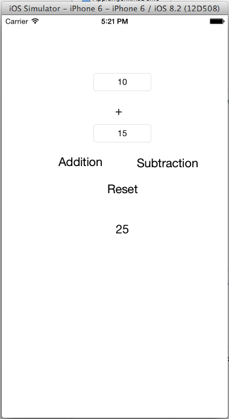
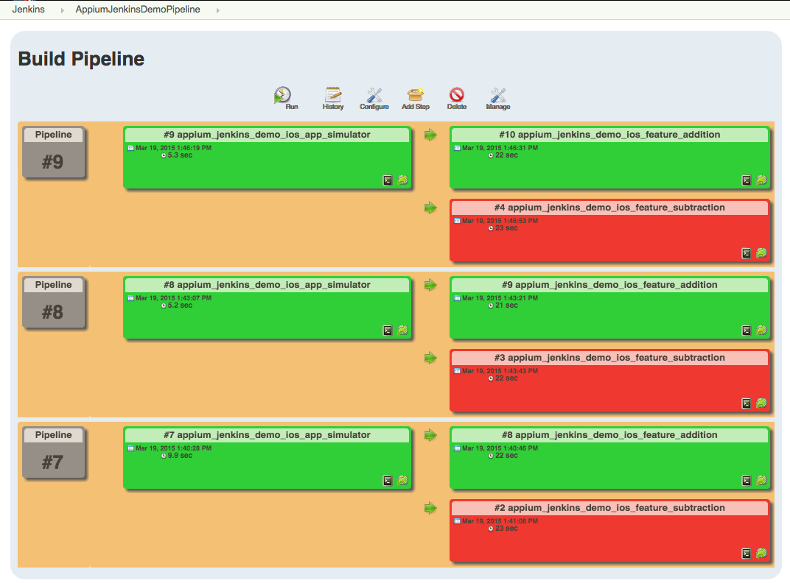

# appium-jenkins-demo

This demo project will helps you in integrating your [appium](http://appium.io) tests with [Jenkins](http://jenkins-ci.org/). This project contains an iOS demo appliation, test examples written in ruby using rspec, instructions and explaination for basic setup. 

After completing this demo you will be able to create a system in which your appium tests will be automatically triggered on simulator or real devices just after any change is made on your master branch.

**Note:** If you do not have any experience in writing test using appium before please go through these [tutorials](http://appium.io/tutorial)


## Table of contents
- [Demo Applications](#demo-applications)
  - [iOS](#ios)
  - [Android](#android)
- [Local Setup](#local-setup)
  - [Prerequisites](#prerequisites)
  - [Clone Project](#clone-project)
  - [Build Demo App Binaries](#build-demo-app-binaries)
    - [iOS](#ios)
    - [Android](#android)
  - [Install Dependencies](#install-dependencies)
    - [Appium](#appium) 
    - [Ruby Gems](#ruby-gems)
- [Run Test Locally](#run-test-locally)
- [Jenkins Setup](#jenins-setup)
  - [Install Jenkins](#install-jenkins)
  - [Install required plugins](#install-required-plugins)
  - [Create Jobs](#create-jobs)
  - [Create Pipeline View](#create-pipeline-view)

## Demo Applications
This repository contains iOS and Android demo applications in ios and android directory respectively.

### iOS
The current iOS demo application is a simple single view calculator app which can add and subtract two numbers. I intentionally put a bug in subtraction feature. Instead of subtracting, it is adding them. Lets see how appium catch this bug.

It looks like this.



### Android
TODO

## Local Setup
### Prerequisites
- Mac OS X (Tested with Version 10.9.5)
- Xcode (Tested with Version 6.2)
- Xcode command line tools
- Node (Tested with Version 0.10.29 installed using [Homebrew](http://brew.sh/))
 
    ```bash
    brew install node 
    ```
- Ruby (Tested with Version 2.1.5 installed using [rbenv](https://github.com/sstephenson/rbenv))

### Clone project

```bash
git clone https://github.com/vbanthia/appium-jenkins-demo.git
cd appium-jenkins-demo
```

### Build demo app binaries
#### iOS
- iOS Simulator

  ```bash
  cd ios

  # Run xcodebuild command
  xcodebuild -target AppiumJenkinsDemo -sdk   iphonesimulator -configuration Debug clean build 
  ```

  - This will create a binary file in ./build/Debug-iphonesimulator/AppiumJenkinsDemo.app


- iOS real device
  - For real device you have to first add yourprovisioning profile and Developer team in project.
  - Open AppiumJenkinsDemo.xcodeproj in Xcode and update Team and Provisioning profile.
  - Run below command
  
  ```bash
  cd ios
  
  # Run xcodebuild command
  xcodebuild -target AppiumJenkinsDemo -sdk   iphoneos -configuration Debug clean build 
  ```
  - This will create a binary file in ./build/Debug-iphoneos/AppiumJenkinsDemo.app

#### Android
TODO

### Install Dependencies
#### Appium
Instead of installing appium globally, I suggest it to install project specific using npm. Appium version is set in [package.json](package.json) file. If you want to change version, update this file.

Install appium using following command

```bash
npm install
```

#### Ruby Gems
Install ruby gems using following command

```bash
bundle install --path=vendor
```

## Run Test Locally
Now you are ready to run test locally. Confirm if every thing is okay by running following command.

```bash
bundle exec rake -T
```

It will return something like below

```bash
rake spec:addition     # Run test for addition feature
rake spec:subtraction  # Run test for subtraciton feature
```

As I explained above, iOS demo app has two features of addition and subtraction. I wrote two different spec files [addition_spec.rb](spec/features/addition_spec.rb) and [subtraction_spec.rb](spec/features/subtraction_spec.rb) and created corresponding rake task to test both the features. As I told before there is a bug in subtraction feature so spec:subtraction task will fail while spec:addition will pass.

Run test using following command

```bash
APP_PATH=./ios/build/Debug-iphonesimulator/AppiumJenkinsDemo.app bundle exec rake spec:(addition|subtraction)
```

You can see the result in html format in result.html file. It will also embed screenshot of the device if test fails.

## Jenkins Setup
If you do not have any experience in using jenkins, I will suggest you to first read about [it](http://jenkins-ci.org/) before going further.

### Install Jenkins
There are many ways to install Jenkins for mac osx. But I will recommend you to install it using [Homebrew](http://brew.sh/)

```bash
brew install jenkins
```

### Install required plugins
Following plugins will be required to run this demo project.
- [Xcode Plugin](https://wiki.jenkins-ci.org/display/JENKINS/Xcode+Plugin)
- [Github Plugin](https://wiki.jenkins-ci.org/display/JENKINS/GitHub+Plugin)
- [rbenv Plugin](https://wiki.jenkins-ci.org/display/JENKINS/rbenv+plugin)
- [Copy Artifact Plugin](https://wiki.jenkins-ci.org/display/JENKINS/Copy+Artifact+Plugin)
- [Build Pipeline Plugin](https://wiki.jenkins-ci.org/display/JENKINS/Build+Pipeline+Plugin)

If you do not know how to install plugin. Please read [this](https://wiki.jenkins-ci.org/display/JENKINS/Plugins#Plugins-Howtoinstallplugins).

### Create Jobs
I have uploaded Jenkins jobs config file in [jobs](jobs) directory. You can create jobs by using those config files.

There are three kind of jobs.

- [appium_jenkins_demo_ios_app_simulator](jobs/appium_jenkins_demo_ios_app_simulator)
  - It will build test application binary for simulator.
- [appium_jenkins_demo_ios_feature_addition](jobs/appium_jenkins_demo_ios_feature_addition)
  - It will run test for addition feature.
- [appium_jenkins_demo_ios_feature_subtraction](jobs/appium_jenkins_demo_ios_feature_subtraction)
  - It will run test for subtraction feature.


### Create Pipeline View
Finally you can create a pipeline view using build pipeline plugin by selecting initial job as appium_jenkins_demo_ios_app_simulator.

It will look like this

